<br><br><br><br>
<div align='center'>
    
    <h4>
        UNIVERSIDADE FEDERAL DO CEARÁ – CAMPUS SOBRAL
    </h4>
    <h4>
       CURSO DE ENGENHARIA DA COMPUTAÇÃO
    </h4>
    <h4>
       DISCIPLINA: TÓPICOS ESPECIAIS EM COMPUTAÇÃO II
    </h4>
    <h4>
       PROFESSOR: FISCHER JONATAS FERREIRA
    </h4>
    <br><br><br>
    <h4>
        TRABALHO ESQUENTA
    </h4>
    <h4>
        EXPERIMENTAÇÃO DE ALGORITMOS DE BUSCA 
    </h4>
    <br><br><br><br>
    <div align='right'>
        <h4>LUCAS RODRIGUES DA SILVA - 428787 <br> </h4>
    </div>
    <br><br><br><br>
    <h4> SOBRAL - CE </h4>
    <h4> 2023.2 </h4>
</div>

##

<br>

<div align='center'>
    <h2> SUMÁRIO </h2>
</div>

<br>

1. [INTRODUÇÃO](#intro)
2. [OBJETIVOS](#obj)
3. [MATERIAIS E MÉTODOS](#mat_met)
    - [Tabela 1: Configurações da Máquina Utilizada](#tabela1)
    - [Trecho de Código 1: Cálculos de Tempo de Execução e Memória](#cod1)
4. [ANÁLISE DOS ALGORITMOS](#analise)
    - [Busca Linear V1 e V2 O(n)](#busca_linear)
    - [Busca Binária O(log n)](#busca_bin)
    - [Busca Quadrática O(n<sup>2</sup>)](#busca_quad)
    - [Busca Ternária O(log n)](#busca_ter)
    - [Busca Cúbica - Tripla Checagem O(n<sup>3</sup>)](#busca_cub)
    - [Resumo Geral dos Experimentos - Tabelas](#res_geral)
    - [Resumo Geral dos Experimentos - Gráficos](#res_geral_graf)
5. [CONCLUSÃO](#conclusao)
6. [REFERÊNCIAS BIBLIOGRÁFICAS](#ref)
   


##

<br>

## 1. INTRODUÇÃO
<a id="intro"></a>

<p align='justify'>
&nbsp; Em ciência da computação, algoritmos de busca, em termos gerais, toma um problema como entrada e retorna a sua solução[1]. Estes algoritmos permitem encontrar um elemento em uma coleção de dados, como listas, árvores ou grafos. Alguns exemplos são citados abaixo:
</p>

- Busca Linear;
- Busca Binária;
- Busca em Profundidade e;
- Busca em Largura.

<p align='justify'>
&nbsp; Cada algoritmo tem sua complexidade, sendo esta uma medida que indica o quanto as operações computacionais consome recursos. A complexidade de um algoritmo pode ser analisada no melhor, pior ou médio caso de execução, podendo variar, no pior caso, de O(1) à O(n!). A figura 1 mostra o tempo necessário (em teoria) para um algoritmo terminar sua execução, de acordo com a complexidade.
</p>

<table align='center'>
    <thead><tr><th>Figura 1: Complexidade dos Algoritmos</th></tr>
    <tbody>
        <tr>
            <td style='text-align: center;'>
                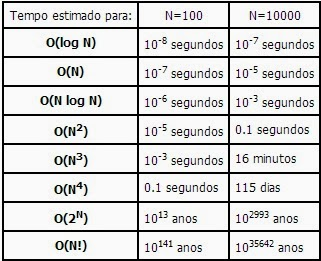
            </td>
        <tr>
    </tbody>
<tfoot>
    <tr>
      <td style='font-size: 11px;'>Fonte: <a href='https://mapoliveira.blogspot.com/2013/10/a-importancia-dos-algoritmos-para-um.html'>mapoliveira.blogspot.com</a></td>
    </tr>
  </tfoot>
</table>

## 2. OBJETIVOS DO EXPERIMENTO
<a id="obj"></a>

- Comparar resultados de diferentes algoritmos de busca;
- Analisar o comportamento e desempenho;
- Avaliar o desempenho e a eficiência dos algoritmos de busca e;
- Identificar as vantagens e desvantagens de cada um.


## 3. MATERIAIS E MÉTODOS
<a id="mat_met"></a>

<P align='justify'>
&nbsp; Para a realização do experimento proposto, utilizou-se a linguagem de programação Python, por ter uma extensa gama de bibliotecas e ser voltada para análise de dados, o que permite a utilização de uma grande quantidade de dados, além da sua versatilidade e facilidade de uso. As configurações da máquina que rodou os experimentos está listada na tabela 1.
</P>

<br>

<h4 align='center'>Tabela 1: Configurações da Máquina Utilizada </h4>
<a id="tabela1"></a>

<table align='center'>
    <thead>
        <tr>
            <th style="text-align:center"><strong>PROCESSADOR</strong></th>
            <th style="text-align:center"><strong>QTD MEMÓRIA RAM</strong></th>
            <th style="text-align:center"><strong>GPU</strong></th>
        </tr>
    </thead>
    <tbody>
        <tr>
            <td style="text-align:center">AMD Ryzen 7 3700U</td>
            <td style="text-align:center">12 GB</td>
            <td style="text-align:center">Integrada - RX Vega 10</td>
        </tr>
    </tbody>
    <tfoot>
        <tr>
            <td style='font-size: 11px;'  colspan='3'>Fonte: Próprio autor.</td>
        </tr>
  </tfoot>
</table>


<p align='justify'>
&nbsp; Os experimentos realizados, visam analisar os tempos de execução e o consumo de memória gasta pelos algoritmos de busca, dando maior foco no pior caso. Os dados utilizados para busca foram disponibilizados anteriormente, mas é possível gerar novos dados utilizando os arquivos:
</p>

- [Gerar Lista Ordenada](gerar_lista_ordenada.py)
- [Gerar Lista Não Ordenada](gerar_lista_nao_ordenada.py)

<p align='justify'>
&nbsp; Para calcular o tempo de execução utilizou-se o módulo time, já para calcular o consumo de memória utilizou-se o módulo tracemalloc, que é uma ferramenta de depuração para rastrear blocos de memória atribuídos por Python [3]. Assim, esses cálculos são mostrados no trecho de código 1.
</p>

#### 3.1 Trecho de código 1: Cálculos de Tempo de Execução e Memória
<a id="cod1"></a>

```
#Inicia o tracemalloc
tracemalloc.start()

#Inicio do tempo
inicio = time.time()

#Executa o algoritmo
indice = algoritmo(*args)

#Termina a contagem do tempo
fim = time.time()
tempo_execucao = fim - inicio

current, peak = tracemalloc.get_traced_memory()
tracemalloc.stop()
current = current / 10**6
peak = peak / 10**6
```
<p align='justify'>
&nbsp; Onde <code>Current</code> é a memória atual e <code>Peak</code> é o pico que a memória chegou ao processar o algoritmo.
</p>

<p align='justify'>
&nbsp; Sendo as listas utilizadas do tipo não ordenadas e ordenadas, os algoritmos<strong> busca binária</strong> e <strong>busca ternária</strong> não foram experimentados para as listas não ordenadas, pois estes necessitam que os dados estejam ordenados previamente. Para os algoritmos <strong>busca quadrática</strong> e <strong>busca cúbica</strong> foram executados somente as listas não ordenadas, por causa das suas complexidades.
</p>


## 4. ANÁLISE DOS ALGORITMOS
<a id="analise"></a>

<p align='justify'>
&nbsp; Para esta análise, foram utilizando os seguintes algoritmos:
</p>

- Busca Linear V1;
- Busca Linear V2;
- Busca Binária;
- Busca Quadrática;
- Busca Ternária e;
- Busca Cúbica - Tripla Checagem.

<p align='justify'>
&nbsp; Juntamente com 13 instâncias de dados, variando seu tamanho e seu tipo, <strong>ordenadas</strong> e <strong>não ordenadas</strong>.
</p>

### 4.1. Busca Linear V1 e V2 O(n)
<a id="busca_linear"></a>

<p align='justify'>
&nbsp; O primeiro algoritmo experimentado foi a busca linear, onde sua execução percorre todo a lista para encontrar o índice do valor procurado.
</p>

#### 4.1.1. Versão 1

<p align='justify'>
&nbsp; Este algoritmo na versão 1, realiza uma busca sequencial (linear) em uma lista e retorna a posição do elemento quando o encontrar. Se o valor procurado não estiver na lista, é retornado -1. Este é um método simples, mas pode não ser eficiente em listas muito grandes, pois sua grande desvantagem é que ele percorre toda o vetor, mesmo se já tiver encontrado o valor.
</p>

#### 4.1.2. Versão 2

<p align='justify'>
&nbsp; Já a versão 2 é uma melhora da versão 1, onde, ao encontrar a primeira ocorrência do valor procurado, já retorna sua posição, assim, dependendo da posição do valor na lista, o tempo de execução é diminuindo consideravelmente, tendo um desempenho melhor em listas maiores.
</p>

#### 4.1.3. Comparação do Tempo de Execução e Consumo de Memória 

<p align='justify'>
&nbsp; Para as duas versões foram utilizados os dois tipos de lista, não ordenada e ordenada, os valores passados para busca foram: 
</p>

- Primeiro item da lista;
- Último item da lista e;
- Um valor aleatório.

<p align='justify'>
&nbsp; Para cada um desses itens, foram feitas 10 iterações, dando um total de 30 iterações para cada instância.
</p>

<p align='justify'>
&nbsp; Analisando os tempos médios de execução para cada instância, nota-se que da primeira instância até a décima não há uma mudança significativa do tempo de execução, mas partindo da décima instância até a décima terceira, o tempo médio aumenta consideravelmente, sendo a versão 2 melhor que a versão 1.
</p>

<p align='justify'>
&nbsp; Para o consumo médio de memória, não há uma mudança significativa dos valores, pode-se notar somente que na lista não ordenada, o consumo de memória até a segunda instância se mantém fixo, mas muda a partir da terceira. Os gráficos referente a essa análise são mostrado nas figuras 2, 3, 4 e 5 para os tempos de execução e nas figuras 6, 7, 8 e 9 para os consumos de memória.
</p>

<br>

<table align='center'>
    <thead>
        <tr><th colspan='4'>Médias do Tempo de Execução (s)</th></tr>
        <tr >
            <th style='text-align: center;'>Figura 2: Busca Linear V1 - Ordenado</th>
            <th style='text-align: center;'>Figura 3: Busca Linear V2 - Ordenado</th>
            <th style='text-align: center;'>Figura 4: Busca Linear V1 - Não Ordenado</th>
            <th style='text-align: center;'>Figura 5: Busca Linear V2 - Não Ordenado</th>
        </tr>
    </thead>
    <tbody>
        <tr>
            <td>
                
            </td>
            <td>
                
            </td>
            <td>
                
            </td>
            <td>
                
            </td>
        </tr>
    </tbody>
    <tfoot>
        <tr>
            <td style='font-size: 11px;'  colspan='4'>Fonte: Próprio autor.</td>
        </tr>
    </tfoot>
</table>

<br>

<table align='center'>
    <thead>
        <tr><th colspan='4'>Médias do Consumo de Memória (MB)</th></tr>
        <tr >
            <th style='text-align: center;'>Figura 6: Busca Linear V1 - Ordenado</th>
            <th style='text-align: center;'>Figura 7: Busca Linear V2 - Ordenado</th>
            <th style='text-align: center;'>Figura 8: Busca Linear V1 - Não Ordenado</th>
            <th style='text-align: center;'>Figura 9: Busca Linear V2 - Não Ordenado</th>
        </tr>
    </thead>
    <tbody>
        <tr>
            <td>
                
            </td>
            <td>
                
            </td>
            <td>
                
            </td>
            <td>
                
            </td>
        </tr>
    </tbody>
    <tfoot>
        <tr>
            <td style='font-size: 11px;'  colspan='4'>Fonte: Próprio autor.</td>
        </tr>
    </tfoot>
</table>

<p align='justify'>
&nbsp; Em uma análise mais profunda das médias, pode-se concluir que para listas pequenas os dois algoritmos se comportam igualmente, mas em uma análise de código, a versão 2 resolve o problema da versão 1, e dependendo do valor procurado a versão 2 tem o tempo de execução melhor.
</p>


### 4.2. Busca Binária O(log n)
<a id="busca_bin"></a>

<p align='justify'>
&nbsp; A busca Binária tem como padrão dividir para conquistar, onde nesse algoritmo é dividido repetidamente o intervalo de busca ao meio, reduzindo pela metade o número de elementos a serem verificados a cada iteração. Isso torna o algoritmo significativamente mais rápido do que a busca linear em vetores grandes, mas a sua desvantagem é que o vetor deve estar ordenado para funcionar corretamente.
</p>

<p align='justify'>
&nbsp; Para o experimento, foi utilizado 10 iterações para cada instância e os seguintes valores para busca:
</p>

- Elemento das extremidades, (Primeiro e Último) e;
- Elemento do meio.

<p align='justify'>
&nbsp; As figuras 10 à 12 e 15 à 17, mostram os tempos de execução e consumo de memória a cada iteração para a décima terceira instância, já as figuras 13 e 17 mostra as médias para cada instância. Pode-se notar que o tempo gasto é imperceptível mesmo o vetor sendo muito grande, e isso é visto principalmente quando o elemento da busca é o do meio. Já para o consumo da memória, referente ao elemento do meio, há um pico de consumo constante. Para os elementos das extremidades, o consumo começa alto e com o decorrer das iterações vai diminuindo e se mantém estável.  
</p>


<table align='center'>
    <thead>
        <tr><th colspan='4'>Tempo de Execução (s)</th></tr>
        <tr >
            <th style='text-align: center;'>Figura 10: Busca Binária - Primeiro Elemento</th>
            <th style='text-align: center;'>Figura 11: Busca Binária - Último Elemento</th>
            <th style='text-align: center;'>Figura 12: Busca Binária - Elemento do Meio</th>
            <th style='text-align: center;'>Figura 13: Busca Binária - Média das instâncias</th>
        </tr>
    </thead>
    <tbody>
        <tr>
            <td>
                
            </td>
            <td>
                
            </td>
            <td>
                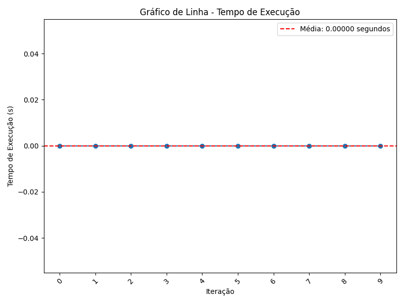
            </td>
            <td>
                
            </td>
        </tr>
    </tbody>
    <tfoot>
        <tr>
            <td style='font-size: 11px;'  colspan='4'>Fonte: Próprio autor.</td>
        </tr>
    </tfoot>
</table>

<br>

<table align='center'>
    <thead>
        <tr><th colspan='4'>Consumo de Memória (MB)</th></tr>
        <tr >
            <th style='text-align: center;'>Figura 14: Busca Binária - Primeiro Elemento</th>
            <th style='text-align: center;'>Figura 15: Busca Binária - Último Elemento</th>
            <th style='text-align: center;'>Figura 16: Busca Binária - Elemento do Meio</th>
            <th style='text-align: center;'>Figura 17: Busca Binária - Média das instâncias</th>
        </tr>
    </thead>
    <tbody>
        <tr>
            <td>
                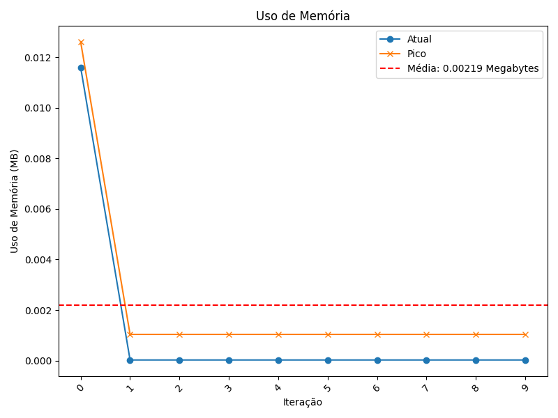
            </td>
            <td>
                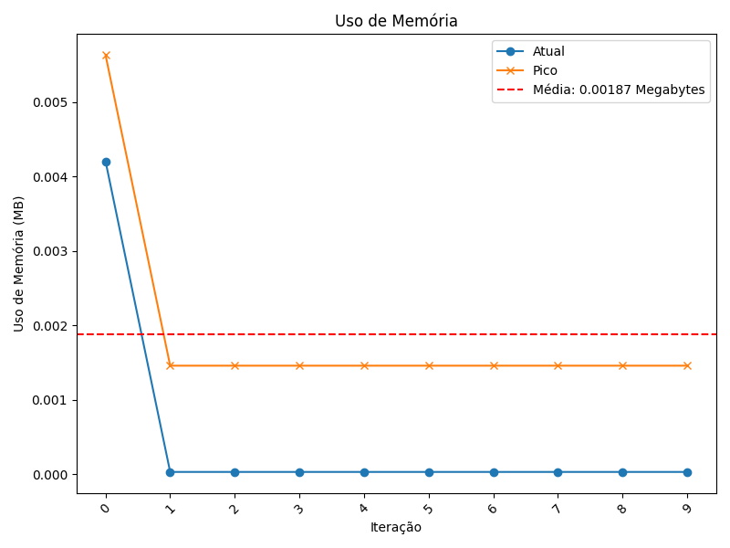
            </td>
            <td>
                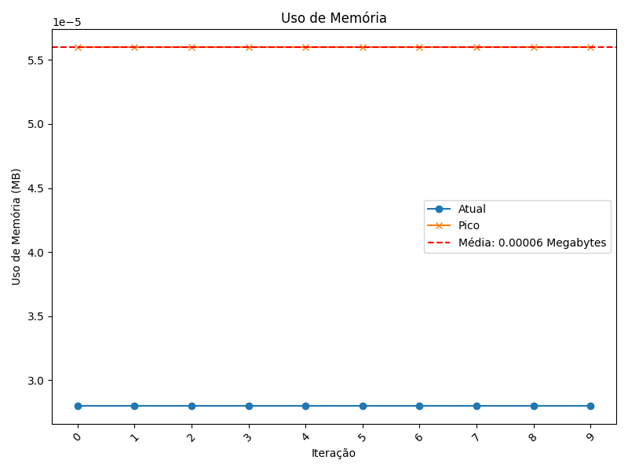
            </td>
            <td>
                
            </td>
        </tr>
    </tbody>
    <tfoot>
        <tr>
            <td style='font-size: 11px;'  colspan='4'>Fonte: Próprio autor.</td>
        </tr>
    </tfoot>
</table>

<p align='justify'>
&nbsp; Em uma análise geral das médias, pode-se ver que o tempo de execução se mantém constante, já o consumo de memória aumenta com o aumento do tamanho da lista. Esse consumo ocorre por conta da recursividade que existe no algoritmo. Assim, com essa análise e os gráficos apresentados, pode-se concluir que, em relação a busca linear, este algoritmo ganha em tempo de execução, mas perde em consumo de memória.
</p>

### 4.3. Busca Quadrática com Contagem de Repetição de Elementos O($n^2$)
<a id="busca_quad"></a>

<p align='justify'>
&nbsp; Este algoritmo busca o elemento na lista e retorna a primeira posição onde ele é encontrado, fazendo também uma contagem de quantas vezes o elemento ocorreu na lista.
</p>

<p align='justify'>
&nbsp; Para o experimento, foi utilizado somente 2 iterações para cada instância (por causa da complexidade do algoritmo) e os seguintes valores para busca:
</p>

- Primeiro item da lista e;
- Um valor aleatório.

<p align='justify'>
&nbsp; As figuras 18, 19, 21 e 22 mostram os tempos de execução e consumo de memória para a décima terceira instância, já as figuras 20 e 23 mostram as médias para cada instância. Analisando essas figuras mencionadas, pode-se observar que para o primeiro elemento, o tempo de execução é relativamente rápido em comparação com um elemento aleatório, visto que o algoritmo tem dois loops aninhados. O consumo de memória começa alto e depois vai decaindo. Este consumo inicial pode se dar por vários fatores que pode não estar relacionado diretamente com o algoritmo em si. 
</p>

 
<table align='center'>
    <thead>
        <tr><th colspan='3'>Tempo de Execução (s)</th></tr>
        <tr >
            <th style='text-align: center;'>Figura 18: Busca Quadrática - Primeiro Elemento</th>
            <th style='text-align: center;'>Figura 19: Busca Quadrática - Elemento Aleatório </th>
            <th style='text-align: center;'>Figura 20: Busca Quadrática - Média das instâncias</th>
        </tr>
    </thead>
    <tbody>
        <tr>
            <td>
                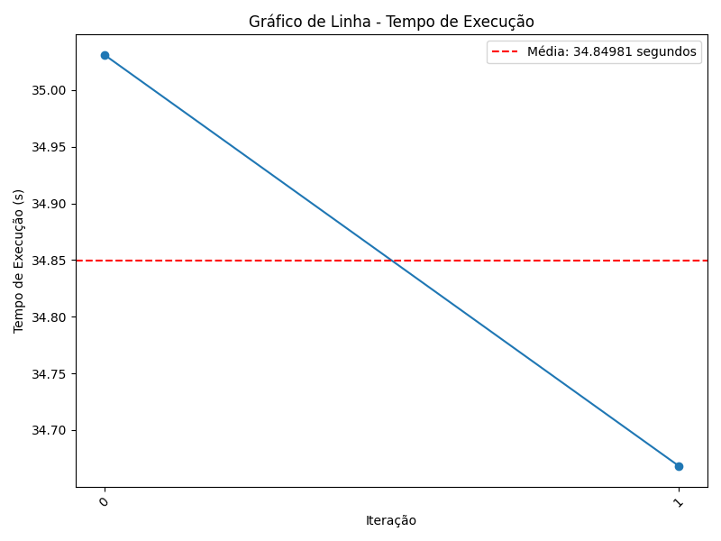
            </td>
            <td>
                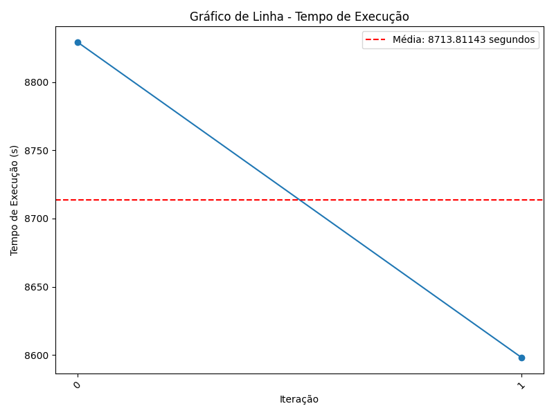
            </td>
            <td>
                
            </td>
        </tr>
    </tbody>
    <tfoot>
        <tr>
            <td style='font-size: 11px;'  colspan='3'>Fonte: Próprio autor.</td>
        </tr>
    </tfoot>
</table>

<br>

<table align='center'>
    <thead>
        <tr><th colspan='3'>Consumo de Memória (MB)</th></tr>
        <tr >
            <th style='text-align: center;'>Figura 21: Busca Quadrática - Primeiro Elemento</th>
            <th style='text-align: center;'>Figura 22: Busca Quadrática - Elemento Aleatório</th>
            <th style='text-align: center;'>Figura 23: Busca Quadrática - Média das instâncias</th>
        </tr>
    </thead>
    <tbody>
        <tr>
            <td>
                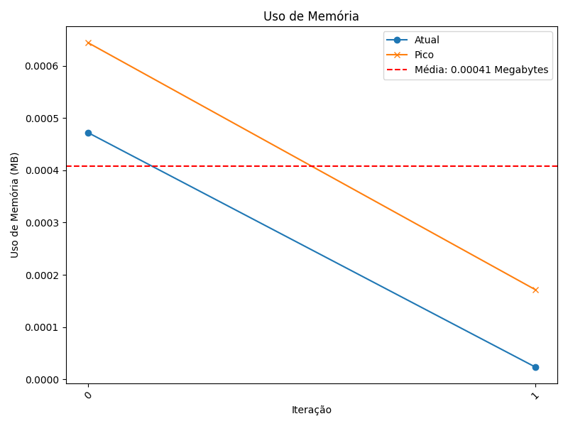
            </td>
            <td>
                
            </td>
            <td>
                
            </td>
        </tr>
    </tbody>
    <tfoot>
        <tr>
            <td style='font-size: 11px;'  colspan='3'>Fonte: Próprio autor.</td>
        </tr>
    </tfoot>
</table>

<p align='justify'>
&nbsp; Ao observar as médias dos tempos de execução, pode-se notar que há variações no decorrer das instâncias e com o aumento do tamanho da lista, o tempo de execução é aumentado consideravelmente, podendo passar horas executando. Para o consumo de memória, também há variações, mas pode-se concluir que ao aumentar a lista o consumo também aumenta. Em comparação aos outros algoritmos mencionados, esse é o menos eficiente, mas ele pode ser otimizado para melhor eficiência, reduzindo o número de loops aninhados.
</p>


### 4.4. Busca Ternária O(log n)
<a id="busca_ter"></a>

<p align='justify'>
&nbsp; Este algoritmo é parecido com a busca binária, mas em vez de dividir em duas partes, é dividido repetidamente a lista em três partes aproximadamente iguais. Com isso faz-se uma verificação do elemento de procura nas partes esquerda, direita e central. Isso permite uma busca eficiente em vetores ordenados, reduzindo pela metade o espaço de busca a cada iteração.
</p>


<p align='justify'>
&nbsp; Para o experimento deste algoritmo foi utilizado 10 iterações para cada instância, e os números procurados foram do tipo:
</p>

- Primeiro elemento
- Elemento Aleatório
- Último Elemento

<p align='justify'>
&nbsp; Como não havia restrições de busca, então foi escolhido esse modelo de valores para procura. Assim, observando a figura 27, pode-se notar que o tempo médio de execução do algoritmo é constante para qualquer tamanho de lista. Já o consumo de memória tem picos, mas ao passar das iterações fica constante. Na média o consumo é crescente, mas nota-se que a partir da instância 5, este fica constante.
</p>

<p align='justify'>
&nbsp; Comparativamente aos algoritmos previamente discutidos, a busca ternária destaca-se como a opção mais eficiente, especialmente no que diz respeito ao consumo de memória. Este algoritmo supera até mesmo a busca binária, uma vez que não recorre à recursividade durante a sua execução.
</p>


<table align='center'>
    <thead>
        <tr><th colspan='4'>Tempo de Execução (s)</th></tr>
        <tr >
            <th style='text-align: center;'>Figura 24: Busca Binária - Primeiro Elemento</th>
            <th style='text-align: center;'>Figura 25: Busca Binária - Último Elemento</th>
            <th style='text-align: center;'>Figura 26: Busca Binária - Elemento Aleatório</th>
            <th style='text-align: center;'>Figura 27: Busca Binária - Média das instâncias</th>
        </tr>
    </thead>
    <tbody>
        <tr>
            <td>
                
            </td>
            <td>
                
            </td>
            <td>
                
            </td>
            <td>
                
            </td>
        </tr>
    </tbody>
    <tfoot>
        <tr>
            <td style='font-size: 11px;'  colspan='4'>Fonte: Próprio autor.</td>
        </tr>
    </tfoot>
</table>

<br>

<table align='center'>
    <thead>
        <tr><th colspan='4'>Consumo de Memória (MB)</th></tr>
        <tr >
            <th style='text-align: center;'>Figura 28: Busca Binária - Primeiro Elemento</th>
            <th style='text-align: center;'>Figura 29: Busca Binária - Último Elemento</th>
            <th style='text-align: center;'>Figura 30: Busca Binária - Elemento Aleatório</th>
            <th style='text-align: center;'>Figura 31: Busca Binária - Média das instâncias</th>
        </tr>
    </thead>
    <tbody>
        <tr>
            <td>
                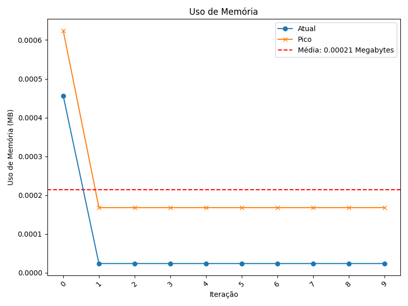
            </td>
            <td>
                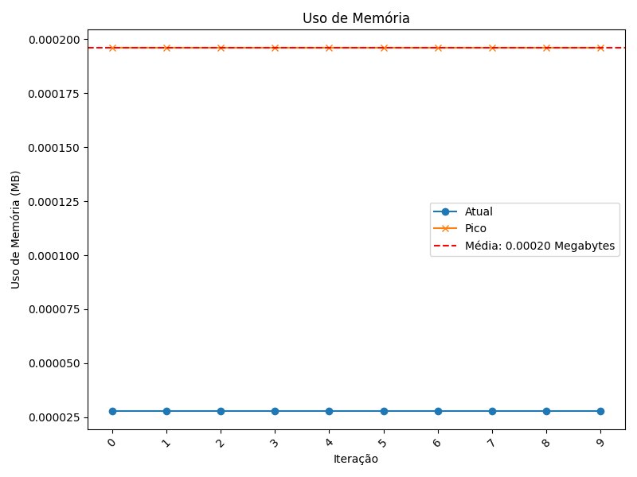
            </td>
            <td>
                
            </td>
            <td>
                
            </td>
        </tr>
    </tbody>
    <tfoot>
        <tr>
            <td style='font-size: 11px;'  colspan='4'>Fonte: Próprio autor.</td>
        </tr>
    </tfoot>
</table>


### 4.5. Busca Cúbica - Tripla Checagem O($n^3$)
<a id="busca_cub"></a>

<p align='justify'>
&nbsp; Este algoritmo procura por um elemento na lista, fazendo uma tripla checagem para verificar se ele realmente está na lista, se estiver retorna a posição inicial onde o elemento foi encontrado, caso contrário retorna -1. Este é um algoritmo de exemplo para demonstrar complexidade O(n<sup>3</sup>).
</p>


<p align='justify'>
&nbsp; Para o experimento foi utilizado somente duas iterações para cada instância, devido ao tempo que demora para concluir a execução. O valor procurado foi somente o elemento central.
</p>

<p align='justify'>
&nbsp; Ao observar as figuras 33 e 35, pode-se notar que em comparação com a busca quadrática, este algoritmo se destaca de forma desfavorável devido ao seu elevado tempo de execução, podendo levar horas para concluir. Além disso, ele apresenta um consumo de memória significativo, que aumenta consideravelmente com o aumento das instâncias de busca, onde esse aumento ocorre a partir da nona instância. Portanto entre todos os algoritmos apresentados, este se posiciona como o menos eficiente, em consonância com sua complexidade computacional O(n<sup>3</sup>)
</p>


<table align='center'>
    <thead>
        <tr><th colspan='2'>Tempo de Execução (s)</th></tr>
        <tr >
            <th style='text-align: center;'>Figura 32: Busca Cúbica - Elemento do Meio</th>
            <th style='text-align: center;'>Figura 33: Busca Cúbica - Média das instâncias</th>
        </tr>
    </thead>
    <tbody>
        <tr>
            <td>
                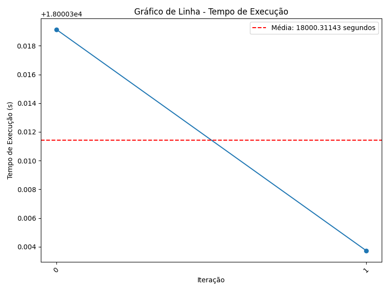
            </td>
            <td>
                
            </td>
        </tr>
    </tbody>
    <tfoot>
        <tr>
            <td style='font-size: 11px;'  colspan='2'>Fonte: Próprio autor.</td>
        </tr>
    </tfoot>
</table>

<br>

<table align='center'>
    <thead>
        <tr><th colspan='2'>Consumo de Memória (MB)</th></tr>
        <tr >
            <th style='text-align: center;'>Figura 34: Busca Cúbica - Elemento do Meio</th>
            <th style='text-align: center;'>Figura 35: Busca Cúbica - Média das instâncias</th>
        </tr>
    </thead>
    <tbody>
        <tr>
            <td>
                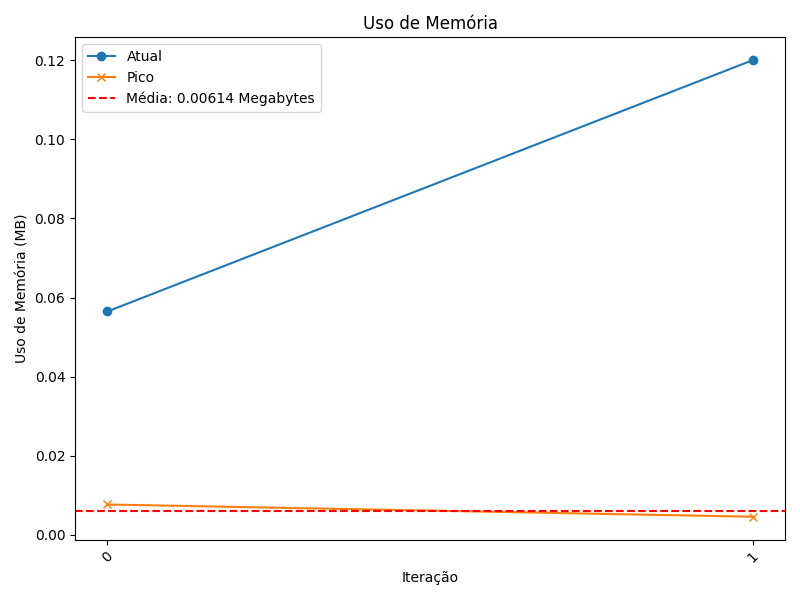
            </td>
            <td>
                
            </td>
        </tr>
    </tbody>
    <tfoot>
        <tr>
            <td style='font-size: 11px;'  colspan='2'>Fonte: Próprio autor.</td>
        </tr>
    </tfoot>
</table>

### 4.6. Resumo Geral dos Experimentos
<a id="res_geral"></a>

<p align='justify'>
&nbsp; As tabelas 2, 3, 4 e 5 mostram um resumo geral dos experimentos feitos para cada instância e cada algoritmo utilizado. Nas linhas onde contém um traço (-), indica que o algoritmo não foi executado para o tipo da lista
</p>

#### Tabela 02: Média Geral do Tempo Gasto - Ordenados
<a id="tabela2"></a>

**Algoritmos**       | **Instância $100$ (s)** | **Instância $200$ (s)** | **Instância $1*10^3$ (s)** | **Instância $2*10^3$ (s)** | **Instância $5*10^3$ (s)** | **Instância $1*10^4$ (s)** | **Instância $5*10^4$ (s)** | **Instância $1*10^5$ (s)** | **Instância $5*10^5$ (s)** | **Instância $1*10^6$ (s)** | **Instância $5*10^6$ (s)** | **Instância $1*10^7$ (s)** | **Instância $1*10^8$ (s)** 
:--------------------:|:--------------------------:|:--------------------:|:---------------------:|:--------:|:--------:|:--------:|:--------:|:--------:|:--------:|:--------:|:--------:|:--------:|:--------:
**Busca Linear v1**| 0.0| 0.0| 0.0| 0.000050 | 0.00060 | 0.00060| 0.01776| 0.04109| 0.18105| 0.36811| 2.01881| 3.57257| 37.89059 |
**Busca Linear v2**| 0.0| 0.0| 0.00052| 0.00052| 0.00073| 0.00093| 0.01152| 0.01224| 0.07502| 0.13395| 1.13667| 2.32817| 12.04875|
**Busca Binária <br>(x sendo as extremidades)**| 0.0| 0.0| 0.0| 0.0| 0.0| 0.0| 0.0| 0.0| 0.0| 0.0| 0.0| 0.0| 0.0 |
**Busca Binária <br>(x sendo o meio)**| 0.0| 0.0| 0.0| 0.0| 0.0| 0.0| 0.0| 0.0| 0.0| 0.0| 0.0| 0.0| 0.0 |
**Busca Quadrática**| - | - | - | - | - | - | - | - | - | - | - | - | - |
**Busca Ternária**| 0.0| 0.0| 0.0| 0.0| 0.0| 0.0| 0.0| 0.0| 0.0| 0.0| 0.0| 0.0| 0.0 |
**Busca Cúbica**| - | - | - | - | - | - | - | - | - | - | - | - | - |
###### Fonte: Próprio autor.


##

### Tabela 03: Média Geral do Tempo Gasto - Não Ordenados
<a id="tabela3"></a> 

**Algoritmos**       | **Instância $100$ (s)** | **Instância $200$ (s)** | **Instância $1*10^3$ (s)** | **Instância $2*10^3$ (s)** | **Instância $5*10^3$ (s)** | **Instância $1*10^4$ (s)** | **Instância $5*10^4$ (s)** | **Instância $1*10^5$ (s)** | **Instância $5*10^5$ (s)** | **Instância $1*10^6$ (s)** | **Instância $5*10^6$ (s)** | **Instância $1*10^7$ (s)** | **Instância $1*10^8$ (s)** 
:--------------------:|:--------------------------:|:--------------------:|:---------------------:|:--------:|:--------:|:--------:|:--------:|:--------:|:--------:|:--------:|:--------:|:--------:|:--------:
**Busca Linear v1**|0.0|0.0|0.0|0.0|0.00058|0.00093|0.01691|0.03285|0.17177|0.34097|1.58888|3.25080|31.66597|
**Busca Linear v2**|0.0|0.0|0.0|0.00078|0.00129|0.00129|0.01132|0.02273|0.11511|0.11246|0.36413|1.30345|8.97635|
**Busca Binária**|-|-|-|-|-|-|-|-|-|-|-|-|-|
**Busca Quadrática**|0.0|0.0|0.09424|0.61945|3.64297|14.58448|185.51226|723.18506|29.31432|106.85933|1303.73732|193.00474|4374.33062|
**Busca Ternária**|-|-|-|-|-|-|-|-|-|-|-|-|-|
**Busca Cúbica**|0.03906|0.07682|200.72743|347.44842|647.44842|767.44842|1793.94842|2820.44842|4140.59909|6768.57125|8840.79478|14400.43911|18000.31143|
###### Fonte: Próprio autor.

##

### Tabela 04: Média Geral do Consumo da Memória Gasta - Ordenados
<a id="tabela4"></a> 

**Algoritmos**       | **Instância $100$ (s)** | **Instância $200$ (s)** | **Instância $1*10^3$ (s)** | **Instância $2*10^3$ (s)** | **Instância $5*10^3$ (s)** | **Instância $1*10^4$ (s)** | **Instância $5*10^4$ (s)** | **Instância $1*10^5$ (s)** | **Instância $5*10^5$ (s)** | **Instância $1*10^6$ (s)** | **Instância $5*10^6$ (s)** | **Instância $1*10^7$ (s)** | **Instância $1*10^8$ (s)** 
:--------------------:|:--------------------------:|:--------------------:|:---------------------:|:--------:|:--------:|:--------:|:--------:|:--------:|:--------:|:--------:|:--------:|:--------:|:--------:
**Busca Linear v1**|0.00009|0.00015|0.00015|0.00015|0.00015|0.00015|0.00015|0.00015|0.00015|0.00015|0.00015|0.00015|0.00015|
**Busca Linear v2**|0.00009|0.00015|0.00015|0.00015|0.00015|0.00015|0.00015|0.00015|0.00015|0.00015|0.00015|0.00015|0.00015 |
**Busca Binária <br>(x sendo as extremidades)**|0.00017|0.00047|0.00047|0.00052|0.00063|0.00068|0.00079|0.00084|0.00095|0.00100|0.00116|0.00121|0.00137|
**Busca Binária <br>(x sendo o meio)**|0.00017|0.00047|0.00047|0.00052|0.00063|0.00068|0.00079|0.00084|0.00095|0.00100|0.00116|0.00121|0.00137|
**Busca Quadrática**|-|-|-|-|-|-|-|-|-|-|-|-|-|-|
**Busca Ternária**|0.00002|0.00017|0.00017|0.00017|0.00020|0.00020|0.00020|0.00020|0.00020|0.00020|0.00020|0.00020|0.00020|
**Busca Cúbica**|-|-|-|-|-|-|-|-|-|-|-|-|-|-|
###### Fonte: Próprio autor.

##

### Tabela 05: Média Geral do Consumo da Memória Gasta - Não Ordenados
<a id="tabela5"></a> 

**Algoritmos**       | **Instância $100$ (s)** | **Instância $200$ (s)** | **Instância $1*10^3$ (s)** | **Instância $2*10^3$ (s)** | **Instância $5*10^3$ (s)** | **Instância $1*10^4$ (s)** | **Instância $5*10^4$ (s)** | **Instância $1*10^5$ (s)** | **Instância $5*10^5$ (s)** | **Instância $1*10^6$ (s)** | **Instância $5*10^6$ (s)** | **Instância $1*10^7$ (s)** | **Instância $1*10^8$ (s)** 
:--------------------:|:--------------------------:|:--------------------:|:---------------------:|:--------:|:--------:|:--------:|:--------:|:--------:|:--------:|:--------:|:--------:|:--------:|:--------:
**Busca Linear v1**|0.00009|0.00009|0.00015|0.00015|0.00015|0.00015|0.00015|0.00015|0.00015|0.00015|0.00015|0.00015|0.00015|
**Busca Linear v2**|0.00009|0.00009|0.00015|0.00015|0.00015|0.00015|0.00015|0.00015|0.00015|0.00015|0.00015|0.00015|0.00015|
**Busca Binária**|-|-|-|-|-|-|-|-|-|-|-|-|-|
**Busca Quadrática**|0.00023|0.00023|0.00028|0.00028|0.00028|0.00028|0.00031|0.00031|0.00090|0.00125|0.00093|0.00060|0.00070|
**Busca Ternária**|-|-|-|-|-|-|-|-|-|-|-|-|-|
**Busca Cúbica**|0.00037|0.00037|0.00052|0.00052|0.00051|0.00052|0.00052|0.00112|0.00113|0.00210|0.00213|0.00513|0.00613|
###### Fonte: Próprio autor.

### 4.7. Resumo Geral dos Experimentos - Gráficos
<a id="res_geral_graf"></a> 

<p align='justify'>
&nbsp; As figuras 36 e 37 mostram o histograma dos resultados obtidos nas tabelas 2, 3, 4 e 5.
</p>

<table align='center'>
    <thead>
        <tr><th colspan='2'>Histograma dos Resultados Obtidos</th></tr>
        <tr >
            <th style='text-align: center;'>Figura 36: Media Geral dos Tempos de Execução</th>
            <th style='text-align: center;'>Figura 37: Media Geral dos Consumo de Memória</th>
        </tr>
    </thead>
    <tbody>
        <tr>
            <td>
                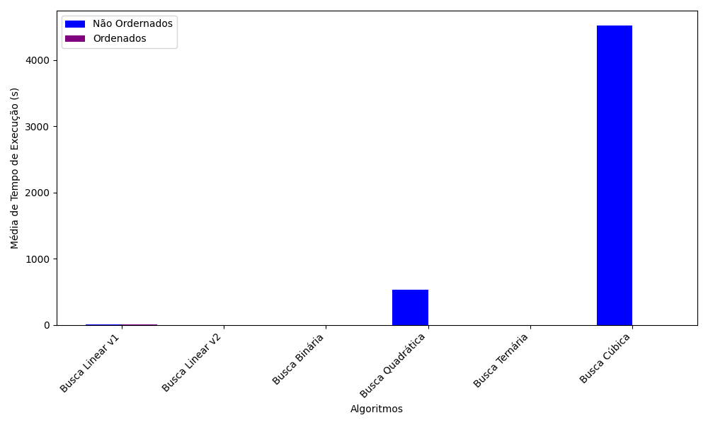
            </td>
            <td>
                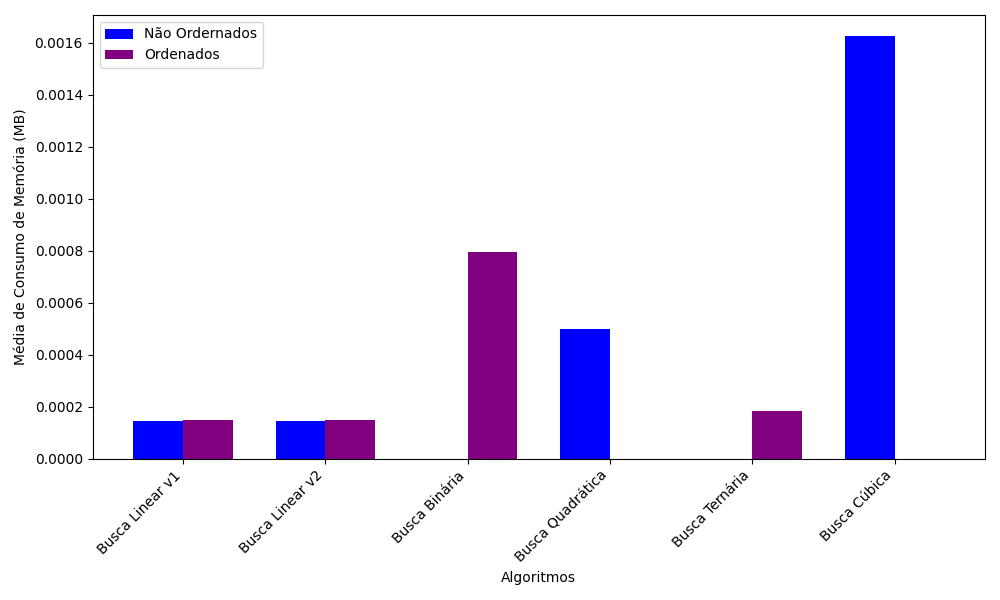
            </td>
        </tr>
    </tbody>
    <tfoot>
        <tr>
            <td style='font-size: 11px;'  colspan='2'>Fonte: Próprio autor.</td>
        </tr>
    </tfoot>
</table>


## 5. CONCLUSÃO
<a id="conclusao"></a>


<p align='justify'>
&nbsp; A experimentação e análise de algoritmos desempenham um papel fundamental na seleção apropriada de abordagens computacionais em cenários do mundo real. Um fator crítico a ser considerado nesse processo é a complexidade no pior caso de um algoritmo, pois isso influencia diretamente em sua eficiência.
</p>

<p align='justify'>
&nbsp; Os resultados obtidos neste estudo revelam que, em muitos casos, a escolha de um algoritmo eficiente pode levar a economias significativas de recursos computacionais. Nesse contexto, a busca ternária se destaca como o algoritmo de melhor eficiência em termos de tempo de execução e consumo de memória entre os algoritmos analisados.
</p>

<p align='justify'>
&nbsp; Portanto, ao enfrentar desafios computacionais no mundo real, a avaliação cuidadosa da complexidade no pior caso e a escolha de algoritmos eficientes desempenham um papel crucial na otimização do desempenho e na gestão eficaz dos recursos computacionais.
</p>


## 6. REFERÊNCIAS BIBLIOGRÁFICAS 
<a id="ref"></a>

<p align='justify'>
    [1] Semântico, Algoritmo de Busca, https://semantico.com.br/vocabulario/algoritmo-de-busca-2/. Acesso em: 31 agosto 2023.
    <br>
    [2] Mapoliveira, A importância dos algoritmos para um engenheiro de software, 2023. https://mapoliveira.blogspot.com/2013/10/a-importancia-dos-algoritmos-para-um.html Acesso em: 1 set. 2023.
    <br>
    [3] Runebook, Tracemalloc - Documentação Python, 2022, https://runebook.dev/pt/docs/python/library/tracemalloc Acesso em: 1 set. 2023.
</p>
